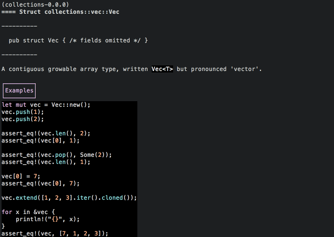

# oxidoc
`oxidoc` is a command-line interface to Rust documentation.



It is alpha-quality software, so some documentation may not be indexed or other strange things may happen.

## Building
Build the crate:
```
cargo build --release
```
In order to generate documentation for the standard library, the `RUST_SRC_PATH` environment variable has to be set with the path of the Rust source code.

Generate documentation for all crates in `~/.cargo/registry/src` and the standard library:
```
oxidoc -g all
```
Generate documentation for the specified crate source directory:
```
oxidoc -g ~/build/oxidoc/
```

The generated documentation currently lives in `~/.cargo/registry/doc`.

## Usage
Provide either an identifier or a partially/fully qualified module path as a search query:
```
oxidoc rand
oxidoc vec::Vec
oxidoc serde::de::DeserializeOwned    
```

## TODO
- Documentation for struct/trait subitems
- Indexing documentation when a type is glob imported from another module
- Partial/fuzzy identifier matching
- Searching by type signature
- Filtering by unsafety/trait
- Showing lifetime information for module paths
- Documenting generics
- Handling non-standard crate entry points
- Provide web browser fallback when emitting documentation with HTML/embedded images
- Probably many other things.
